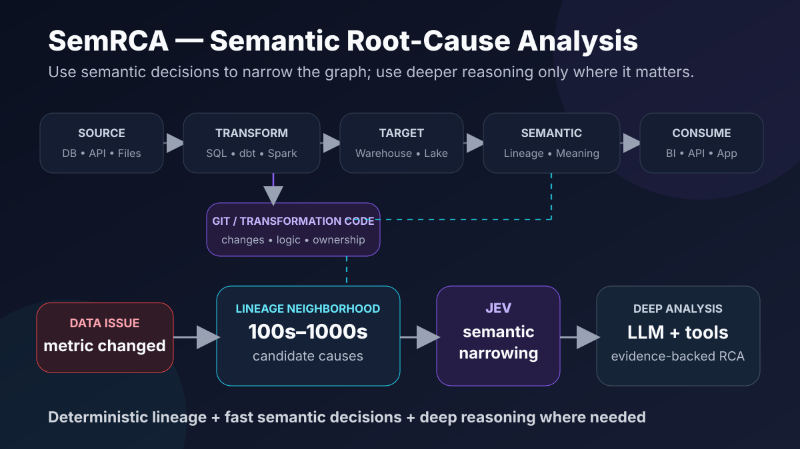
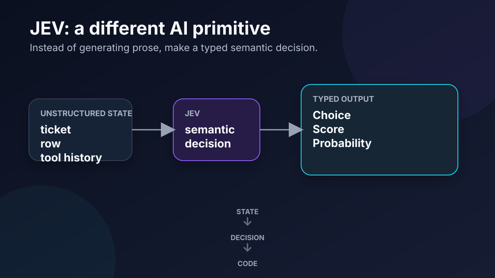
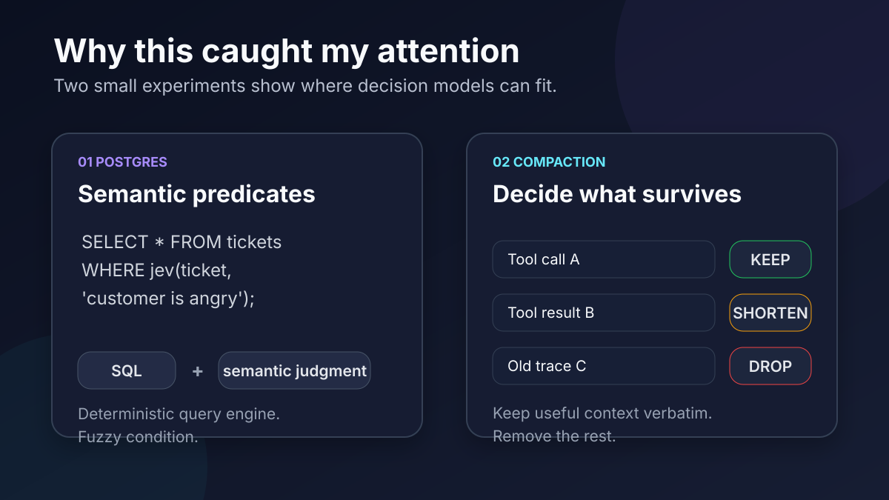

# SemRCA — Semantic Root-Cause Analysis

SemRCA explores a hybrid approach to root-cause analysis across modern data platforms by combining **deterministic lineage**, **semantic decision models**, and **deeper AI reasoning**.

> **Build the graph once. Narrow intelligently. Investigate deeply. Verify with evidence.**

The core idea is that not every intelligent operation in a data platform needs a large generative model. Many RCA steps are smaller semantic decisions: *Is this transformation relevant? Could this schema change affect the metric? Which lineage branch should be investigated next?*



## Why SemRCA?

A production data issue often starts with a simple symptom:

- a KPI suddenly drops,
- a dashboard changes unexpectedly,
- a downstream table becomes incomplete,
- a schema change breaks consumers,
- or an upstream source begins producing anomalous values.

The difficult part is usually not detecting that something changed. It is understanding **why**.

A real investigation may require walking backward across dashboards, semantic definitions, target tables, transformations, code changes, upstream datasets, source systems, and ownership metadata. In a large enterprise platform, that can produce hundreds or thousands of plausible causal paths.

SemRCA is intended to reduce that search space before invoking expensive deep reasoning.

---

## Platform Architecture

```text
SOURCE
   ↓
TRANSFORMATION
   ↓
TARGET
   ↓
SEMANTIC
   ↓
CONSUMPTION
```

### 1. Source

Where data originates.

Examples: relational databases, files/object storage, APIs, SaaS applications, event streams, and operational systems.

A source adapter should expose technical metadata and lineage-relevant information through a common contract or MCP-compatible service.

### 2. Transformation

Where data is changed.

Examples: SQL, Python, dbt, Spark, stored procedures, ETL/ELT platforms, and orchestration workflows.

Transformation logic is a first-class source of knowledge because it contains the rules that connect upstream data to downstream outputs.

### 3. Target

Where transformed data lands.

Examples: warehouses, lakehouses, databases, files, analytical stores, and serving layers.

### 4. Semantic

The semantic layer connects technical lineage with meaning.

It may contain:

- dataset and column lineage
- business concepts and metric definitions
- transformation semantics
- ownership
- schema history
- Git commits
- dependency relationships
- operational metadata

The long-term goal is a **semantic lineage graph** that can be queried repeatedly instead of rediscovering relationships during every incident.

### 5. Consumption

Where people and applications experience the data.

Examples: dashboards, reports, metrics, APIs, applications, notebooks, and ad-hoc analysis.

Consumption is intentionally separate from Target. A warehouse table is a target; a dashboard or business metric built from that table is a consumer.

---

## Git and Transformation Intelligence

SemRCA treats transformation code and Git history as part of the data system.

```text
Data systems
     +
Transformation code
     +
Git history
     +
Metadata
     ↓
Semantic Lineage Graph
```

Rather than asking an AI model to rediscover transformation logic during every incident, SemRCA aims to analyze code and lineage once, persist the resulting graph, and query that understanding many times.

Potential Git-derived signals include:

- which commit changed a transformation
- which columns were added or removed
- whether business logic changed
- which downstream objects depend on changed code
- ownership and contributor history
- timing correlation between deployment and incident

---

## Root-Cause Analysis Flow

```text
DATA ISSUE
    ↓
LINEAGE NEIGHBORHOOD
    ↓
Hundreds / thousands
of candidate causes
    ↓
SEMANTIC NARROWING
    ↓
Relevant candidates
    ↓
DEEP AI INVESTIGATION
    ↓
EVIDENCE COLLECTION
    ↓
ROOT CAUSE + EXPLANATION
```

SemRCA does not simply ask a model to “find the root cause” from one enormous context window. Different stages have different responsibilities.

### Deterministic systems

Use deterministic tooling for facts that can be retrieved or computed exactly:

- lineage traversal
- schema inspection
- Git history
- dependency resolution
- timestamps
- query execution
- metadata retrieval

### Semantic decision models

Use fast decision models to narrow fuzzy search spaces:

- Is this transformation relevant?
- Could this commit affect the failing metric?
- Does this schema change plausibly propagate downstream?
- Is this anomaly connected to the incident?
- Which lineage branch should be investigated next?

### LLMs / reasoning models

Reserve deeper reasoning for:

- forming hypotheses
- understanding complex transformation logic
- comparing evidence
- planning additional investigation
- producing a human-readable RCA

### Evidence

A model decision is not proof.

The final RCA should be grounded in verifiable evidence such as code diffs, lineage edges, query results, schema changes, deployment timestamps, observed data anomalies, and source-system changes.

---

## Why JEV is interesting here

JEV is one example of a model designed around typed semantic decisions rather than open-ended text generation.

```text
Unstructured State
        ↓
       JEV
        ↓
Choice / Score / Probability
        ↓
       Code
```



That pattern is interesting for SemRCA because RCA contains many small semantic decisions that may not require a large generative model.

Two public experiments illustrate the idea.

### PostgreSQL semantic predicates

[`realZachi/pg-jev`](https://github.com/realZachi/pg-jev) explores JEV-powered semantic filtering, ranking, and classification inside PostgreSQL.

Conceptually:

```sql
SELECT *
FROM tickets
WHERE jev(ticket, 'the customer is angry');
```

SQL keeps doing deterministic computation while the model handles the fuzzy semantic predicate.

### Context compaction

[`tamaratran/fast-jev-compaction`](https://github.com/tamaratran/fast-jev-compaction) explores using JEV to decide which agent context should be kept, shortened, or dropped.

```text
Tool history
     ↓
Semantic decisions
     ↓
KEEP | SHORTEN | DROP
     ↓
Smaller context
```



These examples suggest a broader architectural idea:

> **Use decision models as semantic operators inside larger deterministic systems.**

---

## Design Principles

### Build once, query many times
Extract lineage, transformation meaning, and code relationships ahead of incidents where practical.

### Keep facts deterministic
Do not use AI for information that can be retrieved or computed exactly.

### Use semantic models to reduce search space
Apply model judgment to ambiguous relationships, relevance, classification, and prioritization.

### Use deeper reasoning selectively
Large reasoning models should receive a focused evidence set rather than the entire enterprise data estate.

### Evidence before conclusion
Distinguish hypotheses from verified root causes.

### Model uncertainty explicitly
Semantic decisions are probabilistic. Scores and probabilities should guide investigation, not become unquestioned facts.

### Keep architectural layers separate
Source, Transformation, Target, Semantic, and Consumption remain distinct concepts so the system can integrate with many enterprise technologies.

---

## Service Direction

One possible implementation direction is a set of independently extensible services:

```text
┌───────────────────────┐
│ Source Connectors     │
│ DB • API • Files      │
└──────────┬────────────┘
           │
┌──────────▼────────────┐
│ Transformation Intel │
│ SQL • dbt • Spark     │
│ Git • code analysis   │
└──────────┬────────────┘
           │
┌──────────▼────────────┐
│ Target Connectors     │
│ Warehouse • Lake      │
└──────────┬────────────┘
           │
┌──────────▼────────────┐
│ Semantic Graph        │
│ lineage • meaning     │
└──────────┬────────────┘
           │
┌──────────▼────────────┐
│ RCA Engine            │
│ narrow → reason       │
│ → verify → explain    │
└───────────────────────┘
```

Each service could expose capabilities through APIs and/or MCP, allowing SemRCA to connect to different enterprise systems without coupling the RCA engine to a specific vendor.

---

## Current Exploration

Areas currently being explored:

- canonical lineage graph design
- source and target connector contracts
- transformation-code analysis
- Git-aware lineage
- semantic metadata representation
- JEV / decision-model integration
- candidate ranking and pruning
- RCA orchestration
- evidence verification
- reporting and ad-hoc investigation interfaces

SemRCA is currently an architecture and experimentation project. The design will evolve as these pieces are prototyped.

---

## The Question Behind SemRCA

> **What happens if we stop treating every intelligent operation as a text-generation problem?**

For semantic root-cause analysis, the answer may be:

```text
Build the graph
      ↓
Narrow intelligently
      ↓
Investigate deeply
      ↓
Verify with evidence
      ↓
Explain the root cause
```

That is what SemRCA is exploring.

---

## References

- [TypeSafe — Introducing System One Models & JEV](https://typesafe.ai/blog/introducing-system-one-models-and-jev)
- [pg-jev](https://github.com/realZachi/pg-jev)
- [fast-jev-compaction](https://github.com/tamaratran/fast-jev-compaction)
